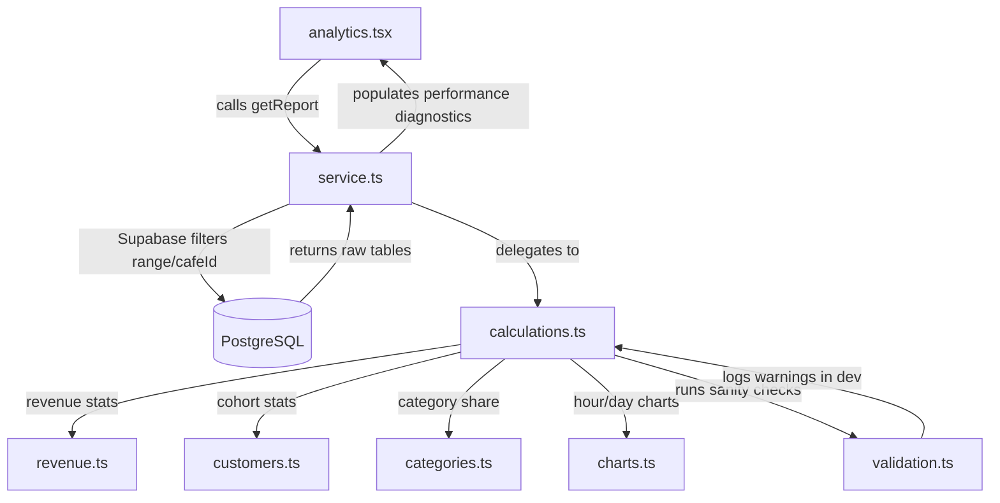

# Analytics Architecture & Developer Guide

This module manages all order, customer, revenue, and category reporting calculations for the Café SaaS Admin Dashboard.

## Calculation Pipeline

---

## Metric Definitions

### 1. Revenue Lifecycle
* **Gross Revenue**: Sums all non-cancelled order totals. Includes unpaid active orders.
* **Paid Revenue**: Sums order totals where `is_paid = true` or `status = 'completed'`. This is the primary revenue KPI.
* **Pending Revenue**: Sums active orders that are not yet paid: `Gross Revenue - Paid Revenue`.
* **Cancelled Value**: Sums order values where `status = 'cancelled'`. Excluded from gross/paid metrics.
* **Average Order Value (AOV)**: Computed as `Paid Revenue / Paid Orders`. Orders with `0` value or unpaid are excluded to avoid skew.

### 2. Customer Cohorts
* **Deduplication**: Customers are grouped by name (case-insensitive, trimmed). Orders with empty names are treated as anonymous walk-ins.
* **New Customer**: A customer who has placed exactly `1` order in the current window.
* **Returning Customer**: A customer who has placed `>1` orders in the current window.
* **Repeat Purchase Rate**: Percentage of customers in the window who have placed multiple orders.

---

## Historical Snapshot Priority

To preserve billing audit trials:
- Calculations **MUST** prefer pricing and item names stored directly in `order_items` record rows over joining `menu_items` tables.
- Since categories are not snapshotted on orders, they are resolved by searching the compiled menu list (which includes archived/unavailable items), ensuring old items are still correctly grouped.

---

## Runtime Validations

The validation module (`validation.ts`) automatically asserts:
1. Chart trend sums match paid revenue and scoped order counts.
2. Category share revenue matches paid revenue.
3. Customer counts do not exceed total orders.
4. Financial ratios (e.g. Paid <= Gross) are within bounds.

---

## Extension Guidelines for Multi-Café Filters

To expand calculations for multi-café dashboard boundaries:
1. Pass the `cafeId` filter down when calling `AnalyticsService.getReport(range, cafeId)`.
2. The service automatically appends `.eq("cafe_id", cafeId)` to filter scoped records at the database level.
